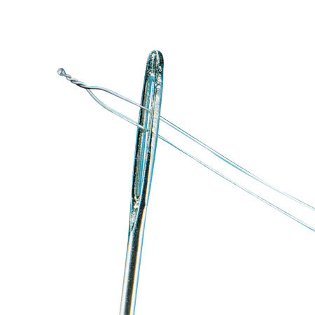
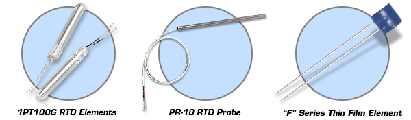

# Informe 01: Sensores de temperatura

## Introducción:

En el presente informe se describen los métodos contemporáneos empleados para el sensado electrónico de temperatura,
tanto los más comunes así como también otros especializados.

Posteriormente se sugerirán los posibles métodos a emplear.

## Transductores y métodos para medida de temperatura:

### Termocuplas:

Las termocuplas son sensores relativamente baratos basados en el efecto Seebeck, descubierto en 1821.  Cuando se unen
dos metales distintos se desarrolla una fuerza electromotriz que es, para cambios pequeños, proporcional a la
temperatura.

Para poder observar de forma práctica este efecto se recurre a la unión de dos (o más) metales distintos, midiéndose
entonces la diferencia total de los potenciales termoeléctricos (la lectura es proporcional a una diferencia de
temperatura por cada unión en el circuito).

Las termocuplas se encuentran estandarizadas de acuerdo a los materiales que las componen y organismos tales como el
NIST[^nist] publican tablas para obtener la temperatura en función de la tensión medida así como también los coeficientes
para ajustar con un polinomio y poder calcularla.

Físicamente se encuentran tanto desnudas (la unión está expuesta al ambiente de medida) así como también recubiertas con
una vaina metálica para protegerlas. A su vez éstas pueden o no estar eléctricamente aisladas de la vaina. Cabe destacar
que esta protección hace más lenta la respuesta de la termocupla frente a cambios de temperatura.

[^nist]: National Institute of Standards and Technology

#### Ventajas:

* Costo: las termocuplas son uno de los sensores más baratos de fabricar.

* Robustez.

* Velocidad de respuesta: debido a su pequeño tamaño las termocuplas sin vaina de protección pueden responder
  prácticamente en forma instantánea a cambios de temperatura.

* Amplio rango de medida: el rango útil comprende aproximadamente de -200°C a 1700°C para los distintos tipos de
  termocuplas estándar.

#### Desventajas:

* Nivel de salida reducido: para la mayoría de las termocuplas en su rango de temperatura útil la salida no supera los
  100mV, lo cual conlleva exigencias particulares en la electrónica de medida (La unión en serie de termocuplas,
  termopila, es una solución parcial a este problema).

* Necesidad de compensación: para poder medir temperatura se utilizan dos uniones termoeléctricas. La unión "caliente"
  en el punto de medida y una unión "fría" de referencia en el instrumento de medida, de la que debe conocerse con
  exactitud su temperatura (por ejemplo, utilizando un baño de hielo).

* No linealidad: la tensión de salida es proporcional a la temperatura solo en rangos estrechos, por lo que se debe
  recurrir a un polinomio de alto orden para obtener una lectura correcta.

* Moderada exactitud: no suele ser mejor que 0.5°C en casos especiales y se requiere de un esfuerzo adicional de
  calibración.

* Precisa conexiones especiales: en todo el tramo desde la termocupla hasta la unidad de medida debe evitarse la unión
  de metales distintos, dado que estos forman a su vez una nueva termocupla y afectan la medida, por lo cual se emplean
  cables y conectores especiales según la clase de termocupla.

* Susceptible a interferencia electromagnética.

* La estabilidad a largo plazo no es muy buena en comparación a otros transductores.

* Dificultad de calibración.

### Termistores:

Los termistores son sensores fabricados en base a óxidos y cerámicas cuya resistencia varía en función de la temperatura.
Los efectos fundamentales fueron documentados por primera vez en 1833 por Michael Faraday.

De acuerdo a cómo varía la resistencia en función de la temperatura se clasifican en PTC (aumenta con temperatura) o NTC
(disminuye al incrementarse la temperatura).

Su principal característica es la alta sensibilidad y no linealidad que presentan.

En rangos de temperatura reducida su respuesta puede aproximarse en forma lineal, aunque generalmente se emplea el
modelo desarrollado por Steinhart y Hart:

$$\frac{1}{T} = A + B ln(R) + C (ln(R))^3 $$

#### Ventajas:

* Costo: los termistores genéricos suelen ser relativamente baratos.

* Tamaño: pueden fabricarse en tamaños extremadamente reducidos, lo que les brinda una alta velocidad de respuesta.

* Alta exactitud: con una adecuada calibración es rutinario resolver milésimas de grado.

* Menos requerimientos en el sistema de medida: debido a su alta resistencia y sensibilidad no suele ser necesario en la
  mayoría de los casos utilizar técnicas de medida especiales tales como conexiones Kelvin (sistema a 4 conductores).

#### Desventajas:

* Fragilidad: debido a su construcción la exposición a temperaturas elevadas, incluso por debajo del límite recomendado,
  resultan en variaciones permanentes de su respuesta característica. También suelen ser más delicados en cuanto a su
  manejo.

* Auto calentamiento: para medir su resistencia se hace circular una corriente por el sensor que a su vez incrementa su
  temperatura. La baja masa térmica debido a su reducido tamaño tampoco contribuye en forma positiva para amenorar este
  efecto

* Falta de estandarización: a diferencia de las termocuplas los termistores no están estandarizados y cada fabricante
  provee el conjunto de constantes para ajustar la respuesta de cada modelo.

### Termoresistores (RTD):

La resistividad de los metales y aleaciones varía en forma marcada con la temperatura. Si bien este efecto es conocido
desde 1821 recién en 1871 Siemens describe el uso de una resistencia de platino para medir la temperatura.

En principio puede utilizarse cualquier metal pero el más difundido es el platino por su estabilidad incluso a altas
temperaturas, respuesta predecible y poca susceptibilidad de ser contaminado.

Físicamente se construyen tanto como resistencias de alambre bobinado o por deposición en un sustrato aislante, las
cuales a su vez pueden encontrarse tanto con protecciones (por ejemplo, vainas metálicas o de cristal) así como también
desnudas.

Las resistencias de alambre de platino son uno de los estándares más utilizados en laboratorios aunque sumamente
frágiles, no solo por riesgo de rotura sino también porque los esfuerzos mecánicos afectan la respuesta característica
del elemento.

La expresión general para la resistencia en función de la temperatura entre 0°C y 600°C está determinada por la
aproximación de Callendar-van Dusen:

$$R_{T} = R_{0} \cdot ( 1 + At + Bt^2) $$

El valor de $R_{0}$ más usual es de 100 ohms (PT100) aunque también se fabrican en 500 y 1000 ohms. El coeficiente *A*
depende de la norma bajo la cual se fabrica el elemento, siendo el más popular 0.003850 / °C para la norma IEC 60751
[^alphas].  El otro coeficiente suele ser (aproximadamente) $B = -5.8 * 10^-7$$ .

[^alphas]: Otros valores son 0.003902 / °C para la norma Americana y  0.003916 / °C para la JIS._

#### Ventajas:

* Salida estable.

* Alta grado de linealidad y repetitividad.

* Relativamente fáciles de calibrar.

* Alta exactitud.

* No precisa de cables especiales.

#### Desventajas:

* Costo: suele ser alto en comparación a las termocuplas y termistores.

* Rango reducido: normalmente son utilizados entre -200°C a 500°C

* Fragilidad: en general, no toleran shocks mecánicos, temperaturas excesivas por sobre su rango nominal ni ser
  expuestos a llama directa o atmósferas corrosivas.

### Semiconductores:

Estos sensores se basan en la dependencia de las características de uniones semiconductoras con la temperatura.

Entre sus principales ventajas se destacan la alta linealidad, facilidad de construcción, posibilidad de incorporarse en
dispositivos integrados y bajo costo. No obstante esto su rango útil es limitado, normalmente inferior 150°C.

### Ópticos / por radiación:

Son métodos que no requieren el contacto directo con el objeto de interés. Se caracterizan por su alta velocidad de
respuesta y límites altos de temperatura máxima.

#### Infrarrojos:

Todos los cuerpos emiten energía de acuerdo a su temperatura en forma proporcional a $T^4$ . Este fenómeno se aprovecha
para determinar la temperatura a distancia. La exactitud es moderada ( ~ 2°C ) y depende en gran parte de la emisividad
del objeto, aunque esto puede solventarse utilizando recubrimientos específicos.

#### Basados en fluorescencia:

Estos sensores se aprovechan de que ciertos fósforos emiten luz al ser estimulados y el tiempo de decaimiento de esta
emisión depende de la temperatura a la que se encuentra. Poseen una exactitud moderada ( ~ 2°C )

#### Basados en espectro de absorción / reflexión:

Consisten en un cristal de arseniuro de Galio en el extremo de una fibra óptica. La longitud de onda a partir de la cual
este se vuelve transparente varía con la temperatura, por lo que midiendo el espectro de reflexión puede calcularse la
temperatura del mismo.

Su principales ventajas son la inmunidad a interferencias electromagnéticas y posibilidad de grandes distancias respecto
del punto de medida. Asimismo, son sensores especializados y de un costo apreciable.

### Acústicos:

La velocidad de propagación del sonido en aire y otros gases es proporcional a la raíz cuadrada de la temperatura
absoluta, midiendo el tiempo que tarda en viajar un pulso a través de un tubo de dimensiones conocidas puede
determinarse la temperatura del mismo.

### Basados en resonancia mecánica:

Estos sensores se basan en la dependencia de la frecuencia de cristales de cuarzo con la temperatura. Pueden obtenerse
altas exactitudes aunque la velocidad de respuesta no es muy elevada.

\pagebreak

## Recomendaciones:

En principio para el rango de temperatura a medir podrían utilizarse tanto termocuplas como RTD. Sin embargo, las
termocuplas acarrean importantes problemas, siendo los más notables su baja estabilidad y la necesidad de conectores y
cables especiales. En segundo lugar se encuentra la necesidad de calibración para obtener la exactitud requerida y pobre
intercambiabilidad[^intercambiabilidad].

[^intercambiabilidad]: El grado de variación en las características de sensor a sensor que permite determinar hasta qué
punto se puede sustituir por otro del mismo tipo sin necesidad de efectuar una calibración.

Por otra parte, actualmente se consiguen RTDs con especificaciones de fábrica que igualan o superan a las necesarias sin
necesidad de calibración. La norma IEC751 establece dos clases primarias para la tolerancia de los sensores:

Clase A: $\pm (0.15^{\circ} C + 0.002 |t|)$

Clase B: $\pm (0.3^{\circ}  C  + 0.005 |t|)$

A su vez, son comunes en la industria las tolerancias llamadas 1/3 DIN y 1/10 DIN que corresponden a la clase B
dividida por 3 y por 10 respectivamente.

Sin necesidad de calibración la clase 1/10 DIN cumple con las especificaciones del problema en todo el rango de
temperaturas. Las otras clases pueden utilizarse sin calibrar contra un patrón de referencia aceptando una merma en la
exactitud a partir de los 200 °C

Pueden emplearse tanto RTDs PT100 como PT1000, pero es preferible utilizar este último tipo dado que los requerimientos
en el proceso de medida de resistencia no son tan estrictos. Para una PT1000 una variación de 0.1 °C a temperatura
ambiente (25°C) significa un cambio aproximado de 0.39 Ohms. De emplearse una PT100 esta cifra sería diez veces menor,
lo cual supone más exigencias tanto en el sistema de medida como también en la calidad de las conexiones.

Por lo anteriormente expuesto, recomiendo emplear un sensor del tipo PT1000.

\pagebreak

## Bibliografía:

* Handbook of modern sensors: Physics, Designs and Applications (3rd edition). Jacob Fraden.

* Practical Guidelines for Temperature Measurement. Omega Corp. http://www.omega.com

* Guide on Secondary Thermometry. Bureau International des Poids et Mesures.

* International Temperature Scale of 1990. Bureau International des Poids et Mesures.

* Thermocouple Measurement. Jim Williams. Linear Tech AN28F.

* "A New Fiber Optical Thermometer and its application for Process Control in Strong Electric, Magnetic and
  Electromagnetic Fields". U.Roland C.P. Renschen and others. - University of Leipzig, Faculty of Physics and Earth
  Sciences (2003).

* Anritsu Meter, http://www.anritsu-meter.com/

* Optocon A.G, catálogo de productos. http://www.optocon.de/en/

* Farnell - Platinum -Temperature Sensors. http://www.farnell.com/datasheets/30616.pdf

* An Introduction to Acoustic Thermometry. Jim Williams, Omar Sanchez-Felipe. Linear Tech AN131F.

* Acoustic gas thermometry. M.R. Moldover, R.M. Gavioso.Bureau International des Poids et Mesures Metrologia, 51 R1
  (2014). http://iopscience.iop.org/0026-1394/51/1/R1/article

* The Linear Quartz Thermometer: a New Tool for Measuring Absolute and Difference Temperatures. Hewlett Packard Journal,
  Vol. 16 No. 7. http://www.hparchive.com/Journals/HPJ-1965-03.pdf

